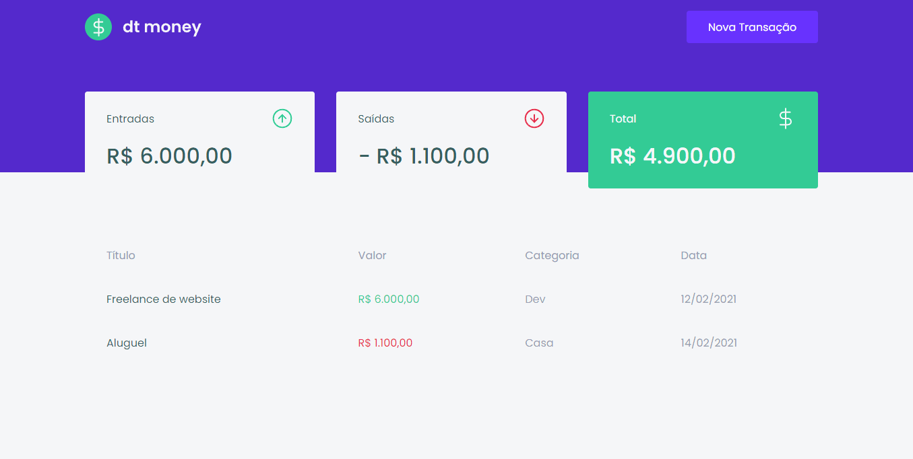

<div align="center" id="top"> 
  
</div>

---
<br>

<div align="center"> 

</div>

<br>

O dtmoney é uma aplicação de controle financeiro. Foi desenvolvida durante as aulas do Chapter II da trilha de ReactJS do Bootcamp Ignite da Rocketseat, e nela é possível cadastrar e excluir transações e ver o saldo de entrada e saída 💲💲


## Visualização

<div align="center">
  
</div>

Você pode visualizar o layout do projeto através [desse link](https://www.figma.com/file/0xmu9mj2TJYoIOubBFWsk5/dtmoney-Ignite-(Copy)?node-id=0%3A1). É necessário ter conta no [Figma](https://figma.com) para acessá-lo.


## Tecnologias

Tecnologias e ferramentas utilizadas neste projeto:

- [React](https://pt-br.reactjs.org/)
- [TypeScript](https://www.typescriptlang.org/)
- [MirageJS](https://miragejs.com/)
- [Polished](https://polished.js.org/)
- [Axios](https://github.com/axios/axios)
- [Styled Components](https://styled-components.com/)
- [React Modal](https://github.com/reactjs/react-modal)


##  Instalação e Inicialização 
Antes de iniciar, você precisa ter o [ Git ] (https://git-scm.com) e o [ Node ] (https://nodejs.org/en/) instalados.

```bash
# Clone este projeto
$ git clone https://github.com/willnogueyra/dtmoney

# Acesso
$ cd dtmoney

# Instalar dependências
$ yarn

# Execute o projeto
$ yarn start

# O servidor irá inicializar no <http: // localhost:3000>
```

##  Licença

Este projeto está sob licença do MIT. Para obter mais detalhes, consulte o arquivo [ LICENSE ] (LICENSE.md).

Feito com 💜 por <a href="https://github.com/willnogueyra" target="_blank"> William Nogueira </a>